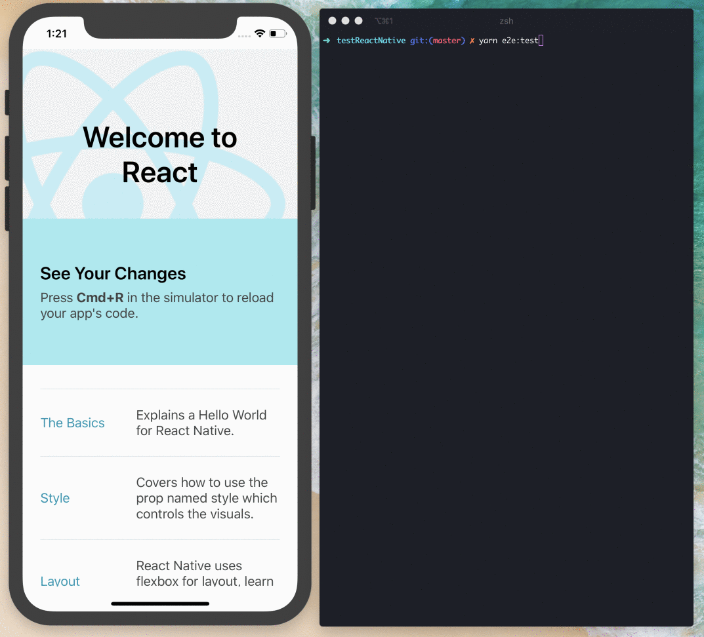

# e2e-react-native-detox

> Project bootstrap with `react-native init` and configured with [Detox](https://github.com/wix/Detox) to provide End-to-End testing

This project has been used as a demo for the article of: [End-to-End testing in React Native with Detox](link-not-defined-yet)

## Setup project

```bash
~ git clone https://github.com/EmaSuriano/e2e-react-native-detox.git
~ cd e2e-react-native-detox
~ yarn
```

## Running Application

### iOS

```bash
~ cd ios; pod install; cd --;
~ react-native run-ios
```

### Android

```bash
~ react-native run-android
```

## Running Detox Tests

Detox is a End-to-End framework focused in mobile applications, in this case it's being used to run tests for a React Native application.

In order to run the tests, first you need to compile the application:

```bash
~ yarn e2e:ci
```



## License

MIT.
